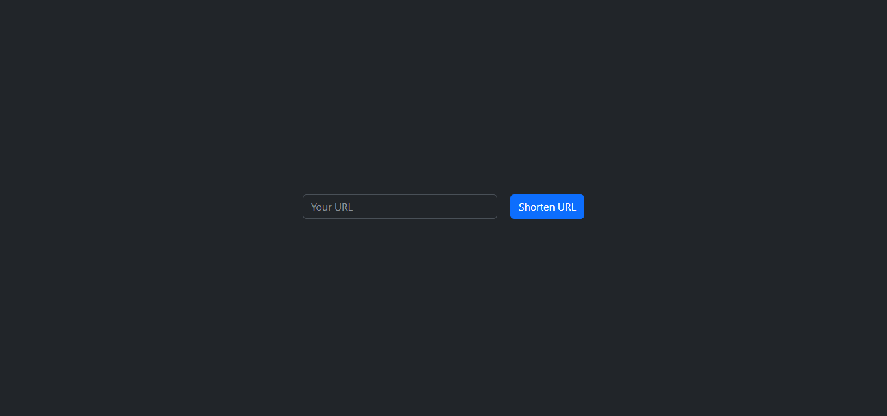
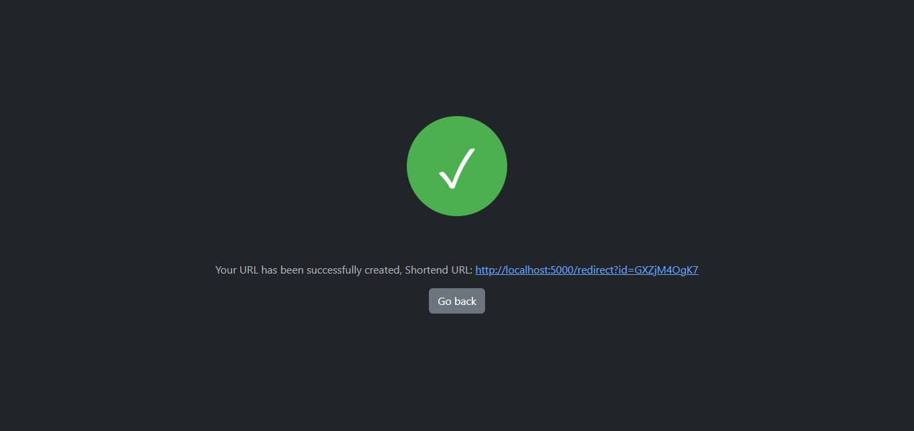

# URL-Shortener

Basic URL Shortener implemented in python flask and bootstrap


## Installation

You can install the project by first cloning the repository:

```bash
git clone https://github.com/XCarCedo/URL-Shortener.git
cd URL-Shortner
```
And then installing required libraries:
```bash
pip install -r requirements.txt
```
After that you can run the project:
```bash
python main.py
```

    
## Screenshots





## Licenses
Check LICENSE file